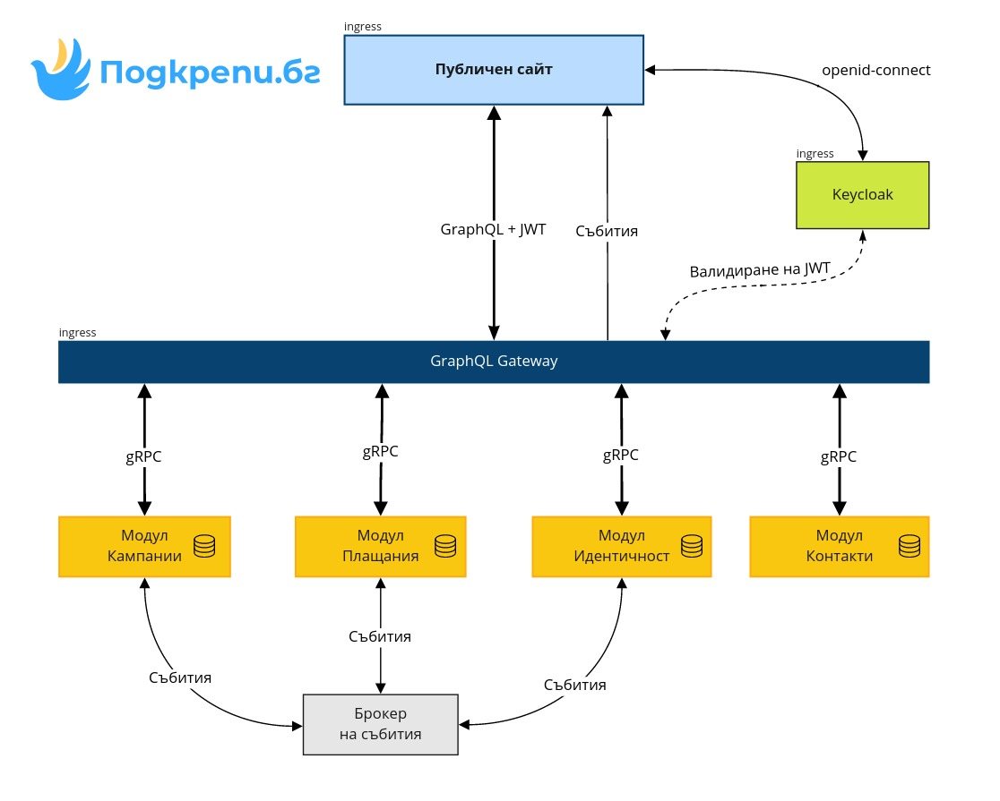
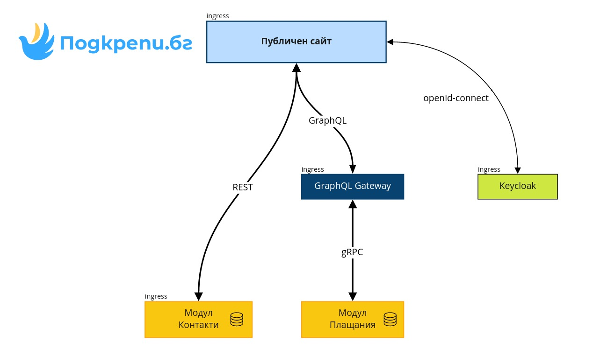

# Технически изисквания

## Въведение

Изисквания към техническата разработка на **open-source** проекта Подкрепи.бг.

## Обхват

Да се създаде **безплатна** и **напълно прозрачна** онлайн платформа за дарения, която да може да се използва свободно от граждани и организации.

## Изисквания

### Публичност

* Кодът на проекта трябва да е публичен и това да не компрометира сигурността;
* Да има публична и лична част на платформата;
* Всеки да може да се регистрира с популярни социални платформи \(Google, Facebook\);
* Дарителите да имат възможност да останат анонимни по желание;
* Всички работни пароли трябва да се намират извън кода на проекта.

### Разработка от доброволци

* Да има добра документация:
  * на архитектурата;
  * на връзките между компонентите;
  * на API ниво чрез swagger или подобни инструменти.
* Да се използват разпространени технологии и работни рамки \(frameworks\);
* Да се използва език със стриктно типизиране;
* Да поддържа бърза разработка на стандартни функционалности;
* Да може да се стартира целият проект локално без голямо натоварване и сложност;
* Да има безопасни за разработка среди \(dev, staging\);
* Да има автоматично:
  * проверка на стила на кода;
  * тестване при създаване на pull request;
  * създаване на контейнери;
  * качване на кода към различните среди.

### **Споделеност**

* По възможност да се преизползват общи:
  * правила за валидация на фронтенд и бекенд;
  * типове на данните;
  * константни стойности;
  * преводи;
  * функционалности.
* По възможност да се използва един и същи език за програмиране.

### Сигурност

* Да се избягват директни външни промени по базата данни;
* Всеки потребител да има достъп само до своите данни;
* Да има автоматични тестове, които потвърждават липсата на изтичане на данни;
* Всички заявки за включване на код да минават през код ревю процес включващ повече от един tech lead.

### Одит и прозрачност

* Всяка промяна на базата данни да се записва;
* Всяко качване или изтриване на файл да се записва;
* Да има вътрешни статистики за употребата на платформата;
* Да се пазят статистиките за определено време;
* Да има скалиране на системата за одит при повишаване на трафика.

### Хранилище за файлове

* Потребителите да имат достъп само до своите и споделените им файлове;
* Потребителите да могат да свалят всичките си файлове при желание \(GDPR\);
* Да има автоматично резервно копие на файловете във външна за платформата среда.

### Бази данни

* Да се използва установена и стабилна база данни;
* Да се използват миграции на базата данни;
* Да се използват отделни потребители с ограничени права за различни нужди;
* Да се използват общи типове на данните за тип на колоните \(домейн, тип\);
* Да се използва row level security \(RLS\) при възможност.

### Инфраструктура

* Да бъде подходящо оразмерена спрямо нуждите на платформата;
* Да поддържа платформата в добро общо състояние;
* Да има добра видимост над натоварването на платформата;
* Да разпределя трафика към различните модули;
* Да бъде осигурена с контрол на достъпа;
* При възможност да поддържа автоматично скалиране при повече трафик.

### Възстановяване след бедствие

* Да се съхранява кодът за възстановяване на системата \(manifests\);
* Да се извършват автоматични резервни копия на базата данни;
* Да се извършват автоматични резервни копия на хранилището за файлове;
* Да има ясна процедура по възстановяване на резервни копия.

### Злоупотреба и атаки

* Да се въведат рейт лимити на входящите заявки;
* Да се използват системи за превенция на DDoS атаки;
* Да има мрежови ограничения за намаляване рисковете от злоупотреби;
* Базите данни да не са достъпни извън системата;
* Да има валидация на входящите данни на всеки слой.

## Възможни варианти

### Фронтенд

* TypeScript:
  * [React](https://reactjs.org/)
  * [Next.js](https://nextjs.org/)
* Графична библиотека:
  * [MaterialUI](https://material-ui.com/)

### Бекенд

* Основен транспорт на данни:
  * GraphQL
    * [Schema](https://graphql.org/learn/schema/)
  * REST:
    * [Swagger](https://swagger.io/)
  * [gRPC](https://grpc.io/)
    * [protoc-gen-doc](https://github.com/pseudomuto/protoc-gen-doc)
* Работна рамка:
  * Golang:
    * [https://gqlgen.com/](https://gqlgen.com/)
    * [https://gofiber.io/](https://gofiber.io/)
  * C\# .NET
    * [ASP.NET Core](https://dotnet.microsoft.com/learn/aspnet/what-is-aspnet-core)
  * TypeScript:
    * [https://nextjs.org/docs/api-routes](https://nextjs.org/docs/api-routes/introduction) \(интегриран с фронтенд\)
    * [https://nestjs.com/](https://nestjs.com/)
    * [https://expressjs.com/](https://expressjs.com/)
  * PHP:
    * [https://laravel.com/](https://laravel.com/)
  * DB driven:
    * [https://postgrest.org/](https://postgrest.org/en/v8.0/)
* База данни:
  * Postgres
  * ORM:
    * [https://www.prisma.io/](https://www.prisma.io/)
    * [Entity Framework](https://docs.microsoft.com/en-us/ef/) \(C\#\)
  * Миграции:
    * [https://flywaydb.org/](https://flywaydb.org/)
    * [Prisma migrate](https://www.prisma.io/docs/concepts/components/prisma-migrate)
    * [https://sqitch.org/](https://sqitch.org/)

### Инфраструктура

* Kubernetes:
  * Управляван от доставчика на облачни услуги
  * On premise
* Docker-compose \(локално\):
  * On premise

## Какво имаме разработено до момента?

До момента успяхме да изградим следната система от микросървиси, свързани с публичният сайт на проекта.

**Модул** **GraphQL Gateway** отговаря за комуникацията между фронтенд и другите сървиси. Неговия публичен транспортен слой е **GraphQL** и функцията му е да прехвърли заявката към конкретния сървис, който отговаря за нея. Между този модул и отделните сървиси комуникацията е чрез транспортен слой **gRPC**, който осигурява независимост от платформата. ****За момента този модул **няма изградени възможности за валидация на JWT** и оторизация на заявките.

**Модулът Контакти** в момента работи с REST заявки, с идеята и той да премине към gRPC. Модул кампании е разработен на C\#/.NET и в момента.

За **Модул Плащания** разработката е стигнала само до модел на базата данни, планът за този модул е да бъде реализиран на **PHP.**

В момента разработката на **Модул Идентичност** все още **не е започната** и **не е избран език** за изпълнението му.

**Не е започната интеграцията** с брокера на събития, но има идея за това да се ползва **Kafka.**

#### Планирана функционалност

#### Реализирана функционалност

## Защо се наложи да променим архитектурата?

### Предизвиквателство: Затруднение с намирането на доброволци

В началото на проекта, това което се знаеше беше, че има над **700 записали се доброволци** в над 10 основни направления и **опит в множество програмни езици.** Архитектурата беше планирана да бъде изградена от хора с познания в различни технологии, като за тази цел всеки трябва да се чувства комфортно да пише на позната технология. Беше направена разбивка и проучване за **най-желани технологии**, което определи и функционалните екипи.

След като мина известно време стана ясно, че активните доброволци, **които наистина са готови да се включат** в проекта с действие, **са десетки, а не стотици**. Това доведе до забавяне прогреса по проекта и **увеличи изискванията за devops помощ** при създаване на нужната комуникационна инфраструктура за микросървиси.

### Предизвикателство: Несъществуващ проблем

След като се консултирахме с **опитни архитекти** от българското ИТ общество, успяхме да установим, че с **текущата архитектура решаваме проблем, който все още нямаме**. Предвид факта, че системата няма работна MVP версия, **това трябва да е нашата цел**. Първоначалната архитектура беше създадена да се справи с хиляди заявки в секунда, но това решение е изпреварило времето си. 

### Предизвикателство: Липса на конкретни технически изисквания

Без конкретни изисквания е **трудно да се определи дали е постигнат желаният резултат** и дали решението съответства на визията на платформата. Изборът на технологии беше направен **спрямо желанията на доброволците**, вместо нуждите на платформата.

### Решение: Използване на една технология

При използването на **три и повече технологии** в един проект, се променя много изискването на опита на доброволците. От една страна това е плюс, тъй като повече хора ще могат да се включат, но от друга - хората са ограничени до включване **само в технологията, която им е позната**. Като сведем разработката до една технология, може би ще намалим броя на доброволците, но хората, които се включат, ще се чувстват по-комфортно да доставят повече функционалности.

### Решение: Преизползване на код

При използването на една технология, можем да преизползваме голяма част от вече разработения код и това **да намали времето за разработка**.

### Решение: Възможност за всеки да работи локално

За по-бързото включване на нови доброволци в проекта, е необходимо цялата система да бъде стартирана в локална среда, без да има връзка към външните компоненти. Това дава **повече сигурност** на неуверените доброволци, **че** **няма да "счупят нещо"**. При архитектурно решение с множество микросървиси на различни технологии, **изискванията за локалната среда се повишават** значително. Разбира се, не изключваме варианта **за работа "на парче"**, но така цялостната интеграция на компонентите **би изисквала повече време**.

## Какво предстои?

### Крачка назад, две напред

След анализ на ситуацията, взехме решение да **рестартираме разработката** и да сменим посоката към по-бързо и лесно за изработка технологично решение.

### Един общ език

Технологията, с която най-голям брой хора от основния екип имат опит, е **TypeScript**. След дискусии се стигна до заключението, че **ако се спрем на един език, ще имаме най-значителен прогрес** по проекта, най-много код ще се преизползва и **най-ефективно ще продължим напред**.

### Една технология

От възможните работни рамки, базирани на TypeScript, най-подходяща се оказа [**NestJS**](https://nestjs.com/)**.**

Бяха взети предвид следните съображения:

* общност на проекта \([https://github.com/nestjs/nest](https://github.com/nestjs/nest) 40k ⭐\);
* документация;
* примерни проекти;
* транспортни слоеве:
  * [REST](https://docs.nestjs.com/controllers)
  * [GraphQL](https://docs.nestjs.com/graphql/quick-start)
  * [Websocket](https://docs.nestjs.com/websockets/gateways)
* включени стандартни компоненти:
  * [модулярност](https://docs.nestjs.com/modules)
  * сигурност:
    * [валидация](https://docs.nestjs.com/techniques/validation)
    * [аутентикация](https://docs.nestjs.com/security/authentication)
    * [оторизация](https://docs.nestjs.com/security/authorization)
    * [rate limiting](https://docs.nestjs.com/security/rate-limiting)
  * [кеширане](https://docs.nestjs.com/techniques/caching)
  * [автоматични тестове](https://docs.nestjs.com/fundamentals/testing)
  * oбработка на грешки
* външни интеграции, които можем да използваме:
  * [Prisma](https://docs.nestjs.com/recipes/prisma)
  * [Swagger](https://docs.nestjs.com/openapi/introduction)
  * [Keycloak](https://github.com/ferrerojosh/nest-keycloak-connect)
  * [Stripe](https://github.com/golevelup/nestjs/tree/master/packages/stripe)
  * [Sentry](https://github.com/ntegral/nestjs-sentry)

### Една база данни

Използвайки **една база** и **една схема,** вместо отделни, ние даваме възможност да се изгради начална работеща версия на приложението без излишни технически препятствия. Когато се намери подходящ сценарий, който изисква отделни схеми и бази, той ще бъде имплементиран.

Подходящо решение, което да ни позволи бързо действие и еднотипни промени по базата, е [Prisma](https://prisma.io/) свързана с [PostgreSQL](https://www.postgresql.org/).

Чрез това решение ние:

* ще намалим времето за разписване на схемата на базата;
* ще се подсигурим, че връзките между обектите са в синхрон;
* ще генерираме типове за обектите в базата автоматично;
* ще генерираме миграционни скриптове автоматично.

Разбира се, това решение, както и всички останали, би имало недостатъци:

* притежава [познати ограничения](https://www.prisma.io/docs/about/prisma/limitations);
* не можем да използваме абсолютно всичко, което [базата поддържа](https://www.prisma.io/docs/concepts/components/prisma-migrate/prisma-migrate-limitations-issues).

## 

