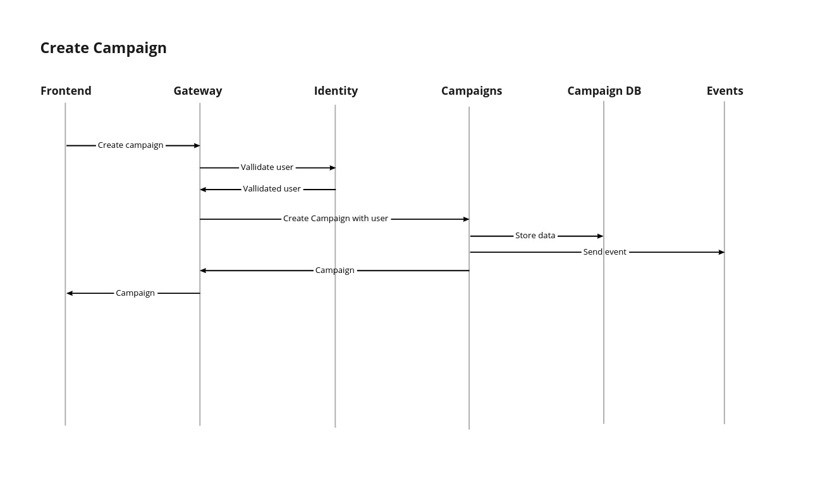

# Обща структура

В архитектурен аспект платформата е разделена на отделни модули. Всеки модул е отговорен за даден домейн, има собствена [база данни](../otdeli/tech-team/baza-danni.md) и няма директна връзка с останалите модули. Комуникацията между модулите е възможна индиректно чрез обмен на евенти през недоуточнен за момента event handler. Идеята е модулите да са възможно най-изолирани един от друг, за да намалим количеството зависимости и да изградим една по-стабилна система.

За момента имаме следните модули:

* [Front-end](../otdeli/tech-team/frontend.md)
* [GraphQL Gateway](../otdeli/tech-team/graphql-gateway.md)
* [Модул Кампании](../otdeli/tech-team/modul-kampanii.md)
* [Модул Плащания](../otdeli/tech-team/modul-plashaniya.md)
* [Модул Identity](../otdeli/tech-team/modul-identity.md)
* [Модул Контакти](../otdeli/tech-team/modul-kontakti.md)

На графиката отдолу е показана комуникацията между отделните модули. Както се вижда GraphQL Gateway прави изключение от правилото за липса на директна комуникация между модулите. Това е така, защото този модул обединява интерфейсите на всички останали модули в един GraphQL интерфейс, който се използва от нашия front-end.

Към този момент конкретната имплементация на event handler-a е неуточнена. Идеята му е да пази историята на всички действия, които са се случили в платформата. Това ще допринесе за прозрачността, а и ще предостави възможност за обмяна на данни между модулите без директни зависимости между тях. 

### Примерни заявки

Тук може да видите 2 примерни заявки идващи от front-enda и как те се обработват от отделните модули преди да се върне отговор към потребителя. 

