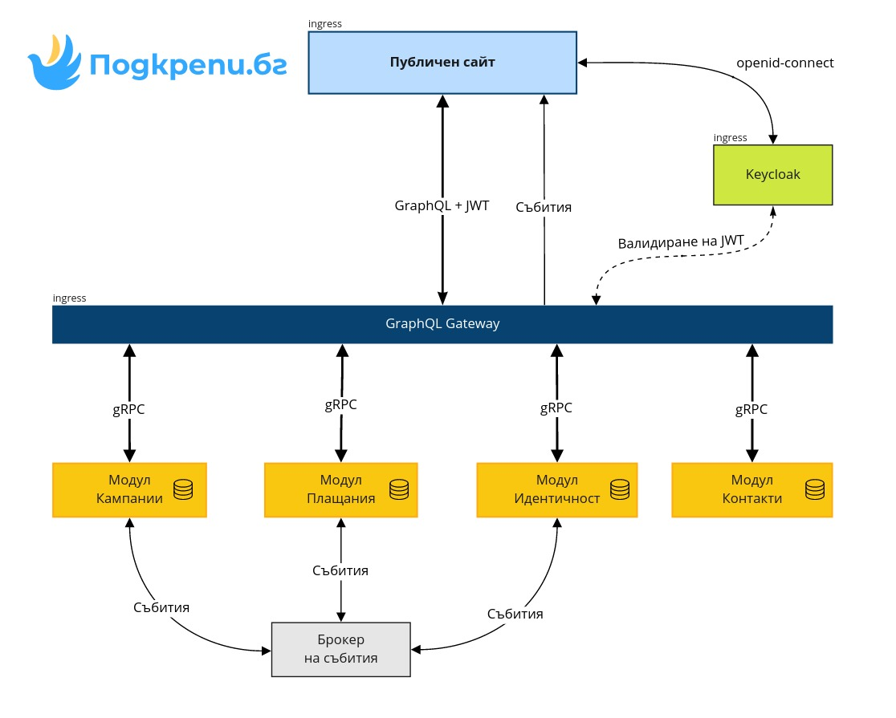

# GraphQL Gateway


Информацията в тази секция вече не е актуална и е запазена с цел проследяване на хронологията!


Модулът отговаря за обединяването на интерфейсите на всички останали модули в един общ GraphQL интерфейс, който се използва от нашия [front-end](frontend.md). Технологиите, които се използват в този модул са:

* [Go](https://golang.org)
* [GraphQL](https://graphql.org)
* [gRPC](https://grpc.io)
* [gqlgen](https://gqlgen.com)

### Автентификация и авторизация

Модулът се грижи за потвърждаването на идентичността на всяка заявка, идваща от front-end-a. Тази част все още не е имплементирана. Когато това се случи, повече детайли ще се появят и тук.

### Събиране на информация

Модулът отговаря за събирането на информация от различните модули за връщането на отговор на една заявка от front-end-a. Например, може да бъде пратена заявка за детайлите към дадена кампания. Това включва информацията за самата кампания, която идва от [модул кампании](module-campaigns.md) + информация за даренията към нея, идващата от [модул плащания](module-payments.md).

### Бизнес логика

Модулът не съдържа никаква бизнес логика от тип "валидация на данни, предоставени от потребителя", "права на потребителя" и т.н. Всички подобни проверки следва да бъдат имплементирани в конкретния модул, а не в gateway-a.

